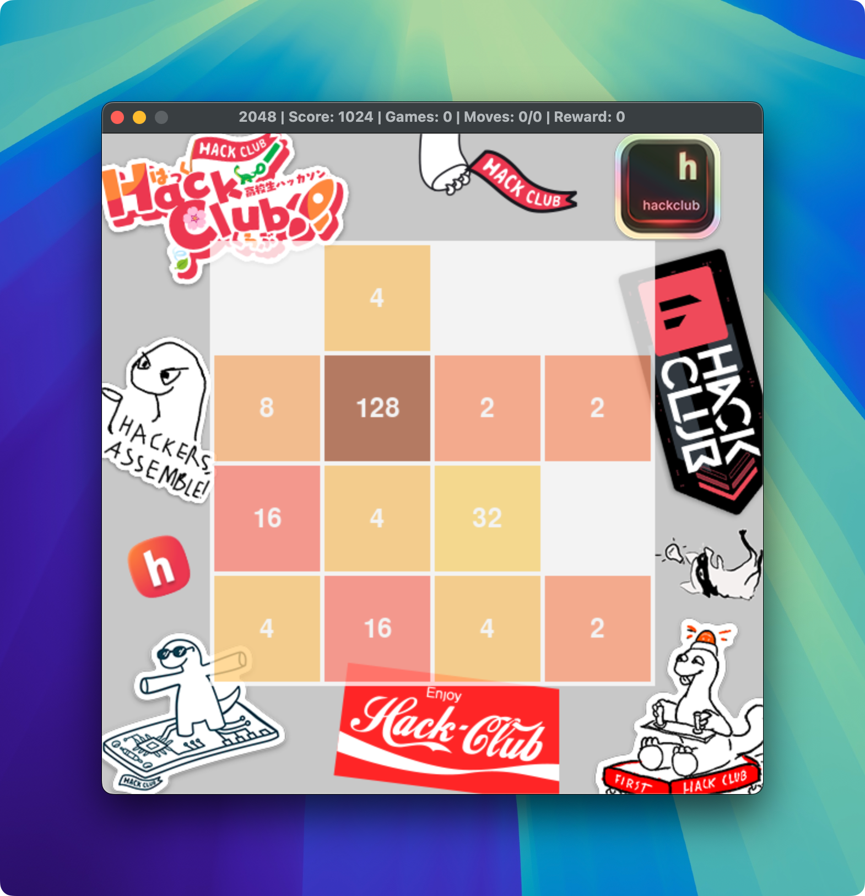

# 2048 AI Game

This project implements an AI agent that learns to play the popular game 2048 using reinforcement learning techniques.

## Project Overview

The 2048 AI Game consists of several components:

1. A game engine that simulates the 2048 game
2. A deep Q-learning network (DQN) model for the AI agent
3. A training controller that manages the learning process
4. A user interface for human players

The AI agent learns to play the game by repeatedly playing and improving its strategy based on the rewards it receives.

## Sneak peek at the UI



The game features a stylish user interface with a unique twist on the classic 2048 design. The background stickers used in the UI are courtesy of the [Hack Club](https://hackclub.com/stickers/).

## File Structure

- `game.py`: Contains the `Game` class that implements the 2048 game logic and rendering.
- `model.py`: Defines the `DQN` (Deep Q-Network) and `DinoGamer` classes for the AI agent.
- `controller.py`: Manages the training process for the AI agent.
- `game_user.py`: Allows human players to play the game.

## Requirements

- Python 3.7+
- PyTorch
- Pygame
- NumPy

## Installation

1. Clone this repository:

   ```
   git clone https://github.com/artem4852/2048.git
   cd 2048
   ```

2. Install the required packages:
   ```
   pip install torch pygame numpy
   ```

## Usage

### Training the AI

To train the AI agent, run:

```
python controller.py
```

This will start the training process. The agent will play multiple games, learning and improving its strategy over time. Training progress and statistics will be displayed on the screen.

If you have done some training and want to continue from that point, set `load_model` to True in the file `controller.py` on line 8.

### Playing as a Human

To play the game yourself, run:

```
python game_user.py
```

Use the arrow keys or WASD to move the tiles.

## AI Model

The AI uses a Deep Q-Network (DQN) implemented in PyTorch. The network architecture consists of several fully connected layers with ReLU activations and dropout for regularization.

Key features of the AI implementation include:

- Experience replay
- Target network for stable learning
- Epsilon-greedy exploration strategy
- Learning rate scheduling

## Customization

You can adjust various parameters in the `model.py` and `controller.py` files to experiment with different learning strategies:

- Learning rate
- Epsilon decay rate
- Replay memory size
- Network architecture

## License

This project is open source and available under the [MIT License](LICENSE).
